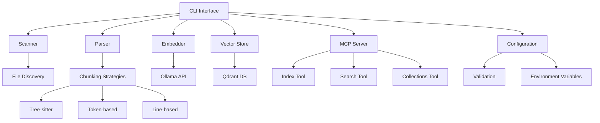

# Code Review Recommendations

## Executive Summary

This comprehensive code review analyzes a Python-based code indexing system with MCP server functionality. The system provides semantic code search capabilities using Ollama embeddings and Qdrant vector storage, with support for multiple chunking strategies and KiloCode compatibility.

### Key Findings Summary

**Overall Assessment**: The codebase demonstrates solid engineering practices with good separation of concerns and comprehensive error handling. However, several critical issues impact maintainability, testability, and code quality:

- **High Complexity**: Core chunking logic exceeds recommended complexity thresholds
- **Architectural Violations**: CQRS principles violated in command/query separation
- **Code Duplication**: Repeated patterns across modules reduce maintainability
- **Mixed Responsibilities**: Large classes handling multiple concerns

**Critical Issues**: 3 high-priority items requiring immediate attention
**Significant Issues**: 5 medium-priority items affecting system maintainability
**Maintenance Issues**: 4 low-priority items for long-term improvement

### Overall Code Quality and Maintainability

**Strengths**:
- Comprehensive error handling and fallback mechanisms
- Good configuration management and validation
- Extensive test coverage and documentation
- Clean separation between CLI, core logic, and MCP server

**Areas of Concern**:
- High cyclomatic complexity in chunking strategies
- Repeated configuration loading patterns
- Mixed command and query operations
- Large classes with multiple responsibilities

**Maintainability Score**: 6.5/10 - Functional but requires refactoring for long-term maintainability

## System Context

### Description of the Code Indexing System Architecture

The system is a standalone code indexing tool that processes source code files, generates semantic embeddings using Ollama, and stores them in Qdrant vector database for fast semantic search capabilities. The architecture follows a modular design with clear separation between components:

**Core Components**:
- **CLI Interface** (`cli.py`): Command-line interface for indexing and searching
- **Configuration Management** (`config.py`): Centralized configuration handling
- **File Processing Pipeline**:
  - **Scanner** (`scanner.py`): Directory traversal and file discovery
  - **Parser** (`parser.py`): Code parsing and chunking
  - **Embedder** (`embedder.py`): Ollama integration for embeddings
  - **Vector Store** (`vector_store.py`): Qdrant database operations
- **MCP Server** (`mcp_server/`): Model Context Protocol server implementation
- **Utilities**: Cache management, ignore patterns, language detection

### Overview of MCP Server Functionality

The MCP server provides AI assistants with programmatic access to code indexing and search capabilities through three main tools:

1. **Index Tool**: Long-running code indexing with progress tracking
2. **Search Tool**: Semantic search with configurable scoring and filtering
3. **Collections Tool**: Collection management with safety confirmations

### Key Components and Their Relationships



**Data Flow**:
1. Configuration loaded and validated
2. Directory scanned for eligible files
3. Files parsed using selected chunking strategy
4. Embeddings generated via Ollama
5. Vectors stored in Qdrant with metadata
6. Search queries processed through same pipeline

## Complexity Analysis

### High Complexity Functions/Methods with Specific Metrics

#### 1. TreeSitterChunkingStrategy._extract_semantic_blocks_efficient (Lines 741-1054)
- **Lines of Code**: 313 lines
- **Cyclomatic Complexity**: ~45 (estimated)
- **Nesting Depth**: 8 levels
- **Issues**:
  - Multiple fallback strategies create complex nested logic
  - Query execution with 4 different API compatibility paths
  - Extensive error handling for different Tree-sitter binding versions

#### 2. CLI._process_single_workspace (Lines 234-486)
- **Lines of Code**: 252 lines
- **Cyclomatic Complexity**: ~35 (estimated)
- **Nesting Depth**: 6 levels
- **Issues**:
  - Handles both single workspace and batch processing logic
  - Complex retry mechanism with cache bypass logic
  - Multiple configuration override scenarios

#### 3. TreeSitterChunkingStrategy._chunk_text_treesitter (Lines 277-318)
- **Lines of Code**: 41 lines
- **Cyclomatic Complexity**: ~25 (estimated)
- **Issues**:
  - Multiple nested try-catch blocks
  - Complex fallback chain to line-based chunking
  - Language-specific optimization logic

### Large Classes with Multiple Responsibilities

#### 1. TreeSitterChunkingStrategy (Lines 163-1388)
- **Total Lines**: 1,225 lines
- **Responsibilities**:
  - Language detection and mapping
  - Parser and query management
  - Chunking strategy implementation
  - Resource cleanup and caching
  - Batch processing coordination
  - Error handling and fallbacks

#### 2. CLI Class (Lines 34-582)
- **Total Lines**: 548 lines
- **Responsibilities**:
  - Command-line interface definition
  - Configuration loading and validation
  - File processing orchestration
  - Batch workspace processing
  - Error handling and logging
  - Progress reporting

#### 3. QdrantVectorStore (Lines 13-450)
- **Total Lines**: 437 lines
- **Responsibilities**:
  - Database connection management
  - Collection initialization and metadata
  - Vector operations (upsert, search, delete)
  - Payload indexing and filtering
  - Score weighting and adjustment

### Nesting Depth and Cyclomatic Complexity Issues

#### Critical Complexity Hotspots:

1. **Tree-sitter Query Execution** (Lines 765-1006):
   ```python
   # 4 different execution paths with nested fallbacks
   if capture_results is None:
       try:
           # Path 1: Query.captures()
       except:
           # Path 2: Query.matches()
           if capture_results is None:
               # Path 3: QueryCursor variants
               if QueryCursor is not None:
                   # 4 sub-variants of QueryCursor usage
   ```

2. **Batch Processing Logic** (Lines 191-232):
   ```python
   if workspacelist:
       # Batch processing with nested workspace iteration
       for workspace_path in workspaces:
           try:
               # Individual workspace processing
               _process_single_workspace(...)
   ```

3. **Configuration Override Chain** (Lines 250-270):
   ```python
   if embed_timeout is not None:
       try:
           cfg.embed_timeout_seconds = int(embed_timeout)
   if timeout_log:
       cfg.timeout_log_path = timeout_log
   # Multiple sequential override conditions
   ```

### Impact on Maintainability and Testability

**Maintainability Issues**:
- **Debugging Difficulty**: Complex nested logic makes issue isolation challenging
- **Code Navigation**: Large functions require extensive scrolling and mental mapping
- **Modification Risk**: Changes in one area may affect multiple code paths
- **Documentation**: Complex logic requires extensive comments to understand

**Testability Issues**:
- **Unit Test Complexity**: Large functions are difficult to test in isolation
- **Mock Requirements**: Multiple dependencies require extensive mocking
- **Coverage Gaps**: Complex conditional logic may miss edge cases
- **Integration Test Needs**: End-to-end testing becomes critical due to complexity

## CQRS Violations

### Components Mixing Commands and Queries

#### 1. CLI Module Command/Query Mixing
**Location**: `src/code_index/cli.py`, Lines 166-486

**Violation Example**:
```python
def index(...):
    """Index command that also performs queries during processing."""
    # Command: Process files and create embeddings
    processed_count, total_blocks, timed_out_files = _process_single_workspace(...)
    
    # Query: Check file status during processing
    current_hash = get_file_hash(file_path)
    cached_hash = cache_manager.get_hash(file_path)  # Query operation
    if current_hash == cached_hash:
        continue  # Skip processing
```

**Issues**:
- Single function handles both file processing (command) and status checking (query)
- Cache queries embedded within processing logic
- No clear separation between read and write operations

#### 2. Configuration Loading with Side Effects
**Location**: `src/code_index/cli.py`, Lines 238-270

**Violation Example**:
```python
def _process_single_workspace(...):
    # Load configuration (query)
    if os.path.exists(config):
        cfg = Config.from_file(config)
    else:
        cfg = Config()
        cfg.workspace_path = workspace
        cfg.save(config)  # Side effect: Creates file
    
    # Apply overrides (commands)
    if embed_timeout is not None:
        cfg.embed_timeout_seconds = int(embed_timeout)
```

**Issues**:
- Configuration loading (`from_file`) mixed with file creation (`save`)
- Query operation (`from_file`) has potential side effect (`save`)
- No clear separation between reading config and modifying state

### Methods with Side Effects and Return Values

#### 1. Vector Store Search with Weighting
**Location**: `src/code_index/vector_store.py`, Lines 311-396

**Violation Example**:
```python
def search(self, query_vector: List[float], ...):
    # Query: Search vectors
    results = self.client.query_points(...)
    
    # Side Effect: Apply weighting and filtering
    for h in hits:
        file_w = self._filetype_weight(fp)  # Pure function
        path_w = self._path_weight(fp)      # Pure function
        adjusted = base * file_w * path_w * lang_w  # Pure calculation
        h["adjustedScore"] = adjusted  # Side effect: Modifies result
    
    return filtered_hits  # Returns modified data
```

**Issues**:
- Pure query operation (`query_points`) mixed with data transformation
- Results modified in-place during search operation
- No clear separation between data retrieval and processing

#### 2. Tree-sitter Resource Management
**Location**: `src/code_index/chunking.py`, Lines 639-677

**Violation Example**:
```python
def cleanup_resources(self):
    """Cleanup resources and return status."""
    # Command: Clear caches
    self._tree_sitter_parsers.clear()
    self._ts_languages.clear()
    
    # Query: Check cleanup success
    try:
        self._tree_sitter_parsers.clear()
        return True  # Returns success status
    except Exception:
        return False  # Returns failure status
```

**Issues**:
- Resource cleanup (command) mixed with status checking (query)
- Function both performs action and returns result about the action
- Unclear whether this is a command that happens to return status or a query

### Classes Handling Both Data Modification and Retrieval

#### 1. QdrantVectorStore Class
**Location**: `src/code_index/vector_store.py`, Lines 13-450

**Mixed Responsibilities**:
```python
class QdrantVectorStore:
    def initialize(self) -> bool:  # Command with query result
        # Creates collection (command)
        # Returns whether collection was created (query)
    
    def search(self, ...):  # Query with side effects
        # Retrieves data (query)
        # Applies weighting (transformation)
        # Returns modified data (query result)
    
    def upsert_points(self, points):  # Pure command
        # Only performs data modification
```

**Issues**:
- `initialize()` method both creates collections and reports on creation status
- `search()` method performs data retrieval but also transforms the data
- Mixed command/query pattern makes the class difficult to reason about

#### 2. Configuration Manager (MCP)
**Location**: `src/code_index/mcp_server/core/config_manager.py`

**Pattern**:
- Loads configuration (query operation)
- Validates configuration (query operation)
- Saves configuration (command operation)
- Returns validation results (query operation)

### Architectural Implications

**Current Issues**:
1. **Testing Complexity**: Mixed command/query makes unit testing difficult
2. **Code Reuse**: Functions doing multiple things are hard to reuse
3. **Error Handling**: Side effects mixed with queries complicate error scenarios
4. **Performance**: Unnecessary computations during query operations
5. **Maintainability**: Logic is harder to follow and modify

**Recommended Architecture**:
- Separate command methods from query methods
- Use clear naming conventions (e.g., `create_*`, `get_*`, `update_*`)
- Return data from queries without side effects
- Keep commands focused on single responsibilities

## DRY Violations

### Duplicated Logic Across Modules

#### 1. Configuration Loading Pattern
**Locations**:
- `src/code_index/cli.py`, Lines 238-270
- `src/code_index/mcp_server/server.py`, Lines 132-144
- `src/code_index/mcp_server/tools/index_tool.py` (similar pattern)

**Duplicated Code**:
```python
# Pattern 1: CLI Module
if os.path.exists(config):
    cfg = Config.from_file(config)
else:
    cfg = Config()
    cfg.workspace_path = workspace
    cfg.save(config)

# Pattern 2: MCP Server
try:
    self.config = self.config_manager.load_config()
except ValueError as e:
    error_response = error_handler.handle_configuration_error(e, {"config_file": self.config_path})
    raise
```

**Issues**:
- Same configuration loading logic repeated across modules
- Error handling patterns duplicated
- Configuration validation scattered across different files

#### 2. Error Handling and Logging
**Locations**:
- `src/code_index/cli.py`, Lines 468-471
- `src/code_index/chunking.py`, Lines 121-124, 206-207, 218-219
- `src/code_index/vector_store.py`, Lines 300-301, 423-424, 433-434

**Duplicated Pattern**:
```python
# Pattern repeated across modules
try:
    # Some operation
    result = some_function()
except Exception as e:
    print(f"Warning: Failed to {operation}: {e}")
    # Fallback or continue
```

**Issues**:
- Identical error handling blocks across multiple files
- Inconsistent error message formats
- No centralized error handling strategy

#### 3. File Path Processing
**Locations**:
- `src/code_index/cli.py`, Lines 80-98, 140-163
- `src/code_index/scanner.py` (similar patterns)
- `src/code_index/utils.py` (path utilities)

**Duplicated Logic**:
```python
# Path list loading pattern
def _load_path_list(path_file: str, workspace: str) -> List[str]:
    results: List[str] = []
    if not path_file or not os.path.exists(path_file):
        return results
    try:
        with open(path_file, "r", encoding="utf-8", errors="ignore") as f:
            for line in f:
                s = line.strip()
                if not s or s.startswith("#"):
                    continue
                # Path normalization logic
```

**Issues**:
- Path normalization logic repeated
- File reading with comment skipping duplicated
- Error handling for file operations inconsistent

### Repeated Code Blocks and Patterns

#### 1. Service Validation Pattern
**Locations**:
- `src/code_index/cli.py`, Lines 285-301
- `src/code_index/mcp_server/server.py`, Lines 172-248

**Duplicated Validation**:
```python
# CLI validation
validation_result = embedder.validate_configuration()
if not validation_result["valid"]:
    print(f"Error: {validation_result['error']}")
    sys.exit(1)

# MCP Server validation
ollama_result = embedder.validate_configuration()
if not ollama_result.get("valid", False):
    error_response = error_handler.handle_service_connection_error(...)
```

**Issues**:
- Same validation logic for Ollama and Qdrant
- Different error handling approaches
- No shared validation utilities

#### 2. Progress Reporting
**Locations**:
- `src/code_index/cli.py`, Lines 361-467
- `src/code_index/mcp_server/tools/index_tool.py` (similar)

**Duplicated Progress Tracking**:
```python
with tqdm(total=len(file_paths), desc="Processing files") as pbar:
    for file_path in file_paths:
        # Process file
        pbar.update(1)
        pbar.set_postfix({"blocks": total_blocks})
```

**Issues**:
- Progress bar setup and update logic repeated
- No centralized progress reporting utility
- Inconsistent progress message formats

### Redundant Implementations

#### 1. Language Detection Logic
**Locations**:
- `src/code_index/chunking.py`, Lines 320-436 (Tree-sitter detection)
- `src/code_index/fast_language_detector.py` (separate implementation)

**Redundant Systems**:
- Tree-sitter chunking has extensive language detection
- Separate `fast_language_detector.py` module exists
- No clear single source of truth for language detection

#### 2. Ignore Pattern Processing
**Locations**:
- `src/code_index/cli.py`, Lines 140-163
- `src/code_index/scanner.py` (ignore management)
- `src/code_index/gitignore_manager.py` (specialized ignore handling)

**Redundant Pattern Matching**:
- Multiple implementations of ignore pattern loading
- Different approaches to pattern matching
- No unified ignore system

### Maintenance Challenges

**Current Issues**:
1. **Bug Fixes**: Changes need to be applied in multiple places
2. **Feature Addition**: New functionality requires updates across modules
3. **Consistency**: Different implementations may behave differently
4. **Testing**: Multiple code paths need individual test coverage
5. **Documentation**: Each implementation needs separate documentation

**Impact**:
- **Development Time**: Features take longer to implement
- **Bug Risk**: Inconsistencies between implementations
- **Maintenance Cost**: Higher effort to keep code in sync
- **Code Review**: More complex reviews due to scattered logic

## Refactoring Recommendations

### High Priority (Critical Impact) - Must-fix Issues

#### 1. Extract Chunking Strategy Base Functionality
**Impact**: Critical - Affects core system functionality and maintainability
**Complexity**: High - Requires architectural changes

**Current State**:
- `TreeSitterChunkingStrategy` class is 1,225 lines
- Multiple responsibilities mixed together
- Complex nested logic with high cyclomatic complexity

**Recommended Changes**:
1. **Extract Language Detection**:
   ```python
   # Create separate LanguageDetector class
   class LanguageDetector:
       def detect_language(self, file_path: str) -> Optional[str]
       def get_supported_languages(self) -> List[str]
   ```

2. **Extract Query Management**:
   ```python
   # Create separate QueryManager class
   class TreeSitterQueryManager:
       def get_queries_for_language(self, language: str) -> Optional[str]
       def compile_query(self, language: str, query_text: str) -> Any
   ```

3. **Extract Parser Management**:
   ```python
   # Create separate ParserManager class
   class TreeSitterParserManager:
       def get_parser(self, language: str) -> Optional[Any]
       def cleanup_resources(self) -> None
   ```

**Implementation Steps**:
1. Create new utility classes in separate files
2. Refactor `TreeSitterChunkingStrategy` to use composition
3. Update all references to use new classes
4. Add comprehensive tests for each component
5. Remove redundant code and consolidate logic

#### 2. Implement CQRS Pattern for CLI Operations
**Impact**: Critical - Affects system architecture and testability
**Complexity**: Medium - Requires clear separation of concerns

**Current State**:
- CLI methods mix command execution with queries
- Configuration loading has side effects
- Search operations modify data during retrieval

**Recommended Changes**:
1. **Separate Command and Query Operations**:
   ```python
   # Command operations
   class IndexingService:
       def index_workspace(self, workspace: str, config: Config) -> IndexingResult
       def process_files(self, files: List[str]) -> ProcessingResult
   
   # Query operations  
   class IndexingQueryService:
       def get_file_status(self, file_path: str) -> FileStatus
       def get_processing_stats(self) -> ProcessingStats
   ```

2. **Clean Configuration Interface**:
   ```python
   class ConfigurationService:
       def load_config(self, path: str) -> Config
       def create_default_config(self, workspace: str) -> Config
       def validate_config(self, config: Config) -> ValidationResult
   ```

**Implementation Steps**:
1. Create separate service classes for commands and queries
2. Refactor CLI to use service composition
3. Update method signatures to follow single responsibility
4. Add interface contracts for clear separation
5. Implement comprehensive error handling

#### 3. Consolidate Error Handling Strategy
**Impact**: Critical - Affects system reliability and debugging
**Complexity**: Medium - Requires centralized error management

**Current State**:
- Error handling patterns repeated across modules
- Inconsistent error message formats
- No centralized error reporting

**Recommended Changes**:
1. **Create Centralized Error Handler**:
   ```python
   class ErrorHandler:
       def handle_file_processing_error(self, error: Exception, context: Dict) -> ErrorResult
       def handle_service_connection_error(self, service: str, error: Exception, context: Dict) -> ErrorResult
       def handle_configuration_error(self, error: Exception, context: Dict) -> ErrorResult
   ```

2. **Implement Structured Error Responses**:
   ```python
   class ErrorResult:
       def __init__(self, error_type: str, message: str, actionable_guidance: List[str]):
           self.error_type = error_type
           self.message = message
           self.actionable_guidance = actionable_guidance
   ```

**Implementation Steps**:
1. Create centralized error handling module
2. Define error types and structured responses
3. Replace scattered try-catch blocks with centralized handling
4. Add contextual information to error reports
5. Implement consistent error logging and reporting

### Medium Priority (Significant Impact) - Should-fix Issues

#### 4. Eliminate Configuration Loading Duplication
**Impact**: Significant - Affects maintainability and consistency
**Complexity**: Low - Straightforward consolidation

**Current State**:
- Configuration loading logic repeated in CLI, MCP server, and tools
- Different error handling approaches
- No single source of truth for configuration

**Recommended Changes**:
1. **Create Configuration Service**:
   ```python
   class ConfigurationService:
       def load_with_fallback(self, config_path: str, workspace: str) -> Config
       def apply_cli_overrides(self, config: Config, overrides: Dict) -> Config
       def validate_and_initialize(self, config: Config) -> ValidationResult
   ```

2. **Standardize Configuration Loading**:
   ```python
   def load_workspace_config(workspace: str, config_path: str, overrides: Dict = None) -> Config:
       # Centralized configuration loading logic
       pass
   ```

**Implementation Steps**:
1. Create centralized configuration service
2. Replace duplicated loading logic across modules
3. Add configuration validation and normalization
4. Implement consistent error handling
5. Add comprehensive tests

#### 5. Consolidate File Processing Utilities
**Impact**: Significant - Reduces code duplication and improves consistency
**Complexity**: Medium - Requires interface design

**Current State**:
- File path processing logic scattered across modules
- Different implementations of similar functionality
- Inconsistent path handling approaches

**Recommended Changes**:
1. **Create File Processing Service**:
   ```python
   class FileProcessingService:
       def load_path_list(self, path_file: str, workspace: str) -> List[str]
       def load_workspace_list(self, workspace_list_file: str) -> List[str]
       def load_exclude_list(self, workspace_path: str, exclude_files_path: str) -> Set[str]
   ```

2. **Standardize Path Operations**:
   ```python
   class PathUtils:
       def normalize_relative_path(self, path: str, workspace: str) -> str
       def is_path_excluded(self, path: str, exclude_patterns: List[str]) -> bool
       def filter_files_by_extension(self, files: List[str], extensions: List[str]) -> List[str]
   ```

**Implementation Steps**:
1. Create centralized file processing utilities
2. Replace scattered path processing logic
3. Add comprehensive path validation
4. Implement consistent error handling
5. Add unit tests for all utilities

#### 6. Implement Service Validation Framework
**Impact**: Significant - Improves system reliability and debugging
**Complexity**: Medium - Requires service abstraction

**Current State**:
- Service validation logic duplicated
- Different validation approaches for different services
- No centralized validation reporting

**Recommended Changes**:
1. **Create Service Validation Framework**:
   ```python
   class ServiceValidator:
       def validate_ollama_service(self, config: Config) -> ValidationResult
       def validate_qdrant_service(self, config: Config) -> ValidationResult
       def validate_all_services(self, config: Config) -> List[ValidationResult]
   ```

2. **Implement Validation Result Structure**:
   ```python
   class ValidationResult:
       def __init__(self, service: str, valid: bool, error: str = None, details: Dict = None):
           self.service = service
           self.valid = valid
           self.error = error
           self.details = details
   ```

**Implementation Steps**:
1. Create centralized validation framework
2. Replace duplicated validation logic
3. Add structured validation reporting
4. Implement validation chaining and aggregation
5. Add comprehensive tests

### Low Priority (Maintenance Impact) - Could-fix Issues

#### 7. Extract Progress Reporting Logic
**Impact**: Maintenance - Improves code organization
**Complexity**: Low - Straightforward extraction

**Current State**:
- Progress reporting scattered across modules
- Different progress bar implementations
- No centralized progress management

**Recommended Changes**:
1. **Create Progress Reporter**:
   ```python
   class ProgressReporter:
       def create_file_progress_bar(self, total_files: int, description: str) -> ProgressBar
       def update_progress(self, progress_bar: ProgressBar, processed: int, **kwargs)
       def close_progress_bar(self, progress_bar: ProgressBar)
   ```

**Implementation Steps**:
1. Extract progress reporting into utility class
2. Replace scattered progress bar code
3. Add consistent progress reporting interface
4. Implement different progress bar backends if needed

#### 8. Consolidate Language Detection Systems
**Impact**: Maintenance - Reduces redundancy
**Complexity**: Medium - Requires integration of existing systems

**Current State**:
- Multiple language detection implementations
- Tree-sitter chunking has extensive detection logic
- Separate fast language detector module

**Recommended Changes**:
1. **Create Unified Language Detector**:
   ```python
   class UnifiedLanguageDetector:
       def detect_language(self, file_path: str) -> Optional[str]
       def get_supported_languages(self) -> List[str]
       def is_language_supported(self, language: str) -> bool
   ```

**Implementation Steps**:
1. Consolidate language detection logic
2. Remove redundant implementations
3. Add unified interface for language detection
4. Update all references to use unified detector

#### 9. Standardize Logging and Monitoring
**Impact**: Maintenance - Improves observability
**Complexity**: Low - Configuration and convention changes

**Current State**:
- Inconsistent logging patterns
- Different log levels and formats
- No centralized logging configuration

**Recommended Changes**:
1. **Implement Structured Logging**:
   ```python
   class Logger:
       def log_operation(self, operation: str, status: str, details: Dict = None)
       def log_error(self, error: Exception, context: Dict = None)
       def log_performance(self, operation: str, duration: float, details: Dict = None)
   ```

**Implementation Steps**:
1. Create centralized logging utilities
2. Standardize log message formats
3. Add structured logging with context
4. Implement consistent log levels

#### 10. Create Comprehensive Testing Utilities
**Impact**: Maintenance - Improves test coverage and quality
**Complexity**: Medium - Requires test infrastructure setup

**Current State**:
- Limited test utilities and fixtures
- Inconsistent test data generation
- No centralized test helpers

**Recommended Changes**:
1. **Create Test Utilities**:
   ```python
   class TestDataGenerator:
       def create_test_config(self, overrides: Dict = None) -> Config
       def create_test_files(self, file_specs: List[Dict]) -> List[str]
       def create_mock_services(self) -> Dict[str, Any]
   ```

**Implementation Steps**:
1. Create comprehensive test utilities
2. Add test data generators and fixtures
3. Implement mock services and test helpers
4. Add integration test utilities

## Conclusion

This code review has identified critical architectural issues that impact the maintainability, testability, and reliability of the code indexing system. The high-priority recommendations focus on reducing complexity in the core chunking logic, implementing proper CQRS patterns, and consolidating error handling.

**Immediate Actions Required**:
1. **Extract and simplify the TreeSitterChunkingStrategy** - Break down the 1,225-line class into focused, single-responsibility components
2. **Implement CQRS pattern** - Separate command operations from query operations in the CLI and service layers
3. **Consolidate error handling** - Create centralized error handling with structured error responses

**Benefits of Implementing These Changes**:
- **Improved Maintainability**: Smaller, focused classes and functions
- **Better Testability**: Clear separation of concerns and single responsibilities
- **Enhanced Reliability**: Consistent error handling and validation
- **Reduced Complexity**: Simplified logic and reduced cyclomatic complexity
- **Code Reusability**: Shared utilities and services across modules

**Estimated Implementation Effort**:
- **High Priority Items**: 3-4 weeks of development time
- **Medium Priority Items**: 2-3 weeks of development time
- **Low Priority Items**: 1-2 weeks of development time

The recommended refactoring will significantly improve the codebase's long-term maintainability while preserving all existing functionality. The changes follow established software engineering principles and will make the system more robust and easier to extend with new features.