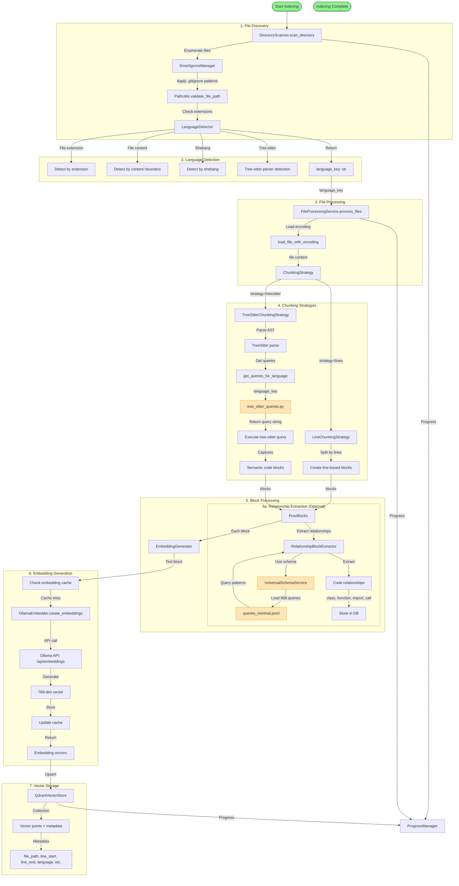
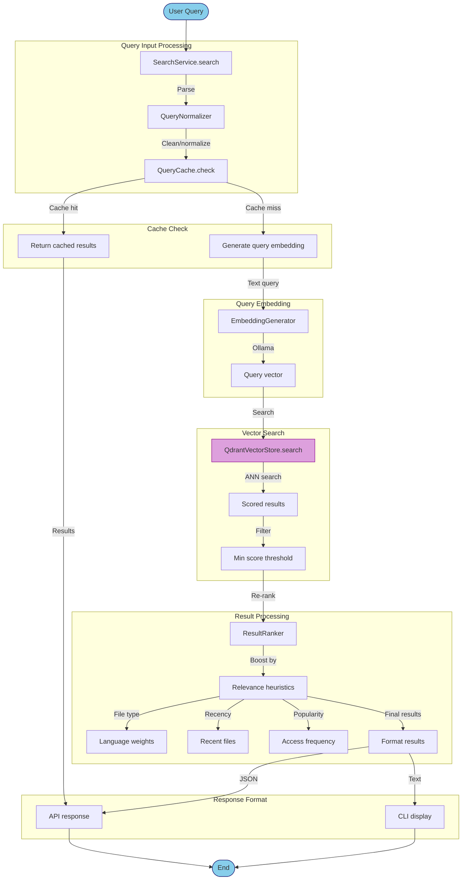

# Code Index - Complete Logic Flow Documentation

## Overview
This document describes the complete flow from initial file scanning through query execution and result processing.

## Architecture Components

### 1. File Scanning & Discovery Layer
- **DirectoryScanner** (`src/code_index/scanner.py`)
- **SmartIgnoreManager** (`src/code_index/smart_ignore_manager.py`)
- **PathUtils** (`src/code_index/path_utils.py`)
- **FileProcessingService** (`src/code_index/services/core/file_processing_service.py`)

### 2. Language Detection & Parsing
- **LanguageDetector** (`src/code_index/indexing/language_detector.py`)
- **TreeSitterFileProcessor** (`src/code_index/services/treesitter/file_processor.py`)
- **CodeParser** (`src/code_index/parser.py`)
- **HybridParsers** (`src/code_index/hybrid_parsers.py`)

### 3. Query Management
- **QueryManager** (`src/code_index/query_manager.py`)
- **QueryService** (`src/code_index/services/core/query_service.py`)
- **QueryCache** (`src/code_index/services/query/query_cache.py`)
- **tree_sitter_queries.py** (`src/code_index/treesitter_queries.py`) - Language-specific query strings
- **universal_schema_service.py** (`src/code_index/services/query/universal_schema_service.py`) - 908-record relationship schema

### 4. Relationship Extraction
- **TreeSitterBlockExtractor** (`src/code_index/services/treesitter/block_extractor.py`)
- **RelationshipBlockExtractor** (`src/code_index/services/treesitter/relationship_extractor.py`)
- **TreeSitterQueryManager** (`src/code_index/services/treesitter/query_manager.py`)

### 5. Indexing & Storage
- **IndexOrchestrator** (`src/code_index/indexing/orchestrator.py`)
- **BatchManager** (`src/code_index/indexing/batch_manager.py`)
- **FileProcessor** (`src/code_index/indexing/file_processor.py`)
- **QdrantVectorStore** (`src/code_index/vector_store.py`)
- **IndexingDependencies** (`src/code_index/services/shared/indexing_dependencies.py`)

### 6. Search & Results
- **SearchService** (`src/code_index/services/core/search_service.py`)
- **EmbeddingGenerator** (`src/code_index/services/embedding/embedding_generator.py`)
- **ResultProcessor** (`src/code_index/search/result_processor.py`)
- **SimilaritySearchStrategy** (`src/code_index/search/similarity_search_strategy.py`)
- **EmbeddingSearchStrategy** (`src/code_index/search/embedding_search_strategy.py`)

### 7. Chunking Strategies
- **ChunkingStrategy** (base, `src/code_index/chunking.py`)
- **LineChunkingStrategy** (`src/code_index/chunking.py`)
- **TreeSitterChunkingStrategy** (`src/code_index/chunking.py`)

---

## Complete Flow: File Scan → Query → Results



---

## Query Execution Flow



---

## Tree-Sitter Query System Details

```mermaid
graph TD
    subgraph "tree_sitter_queries.py"
        TQDict[queries dictionary]
        TQDict -->|Key| Python["python": {...}]
        TQDict -->|Key| Java["java": {...}]
        TQDict -->|Key| JS["javascript": {...}]
        TQDict -->|Key| Rust["rust": {...}]
        TQDict -->|20+ languages| Other[other languages]
        
        Python -->|Query| PyFunc[function_definition]
        Python -->|Query| PyClass[class_definition]
        Python -->|Query| PyImport[import_statement]
        
        Java -->|Query| JavaClass[class_declaration]
        Java -->|Query| JavaMethod[method_declaration]
        
        style TQDict fill:#FFE4B5,stroke:#DAA520
    end
    
    subgraph "universal_schema_service.py"
        US[UniversalSchemaService]
        US -->|Load| QL[queries_minimal.jsonl]
        QL -->|908 records| Schema[Relationship schema]
        
        Schema -->|Type| Class[class]
        Schema -->|Type| Func[function]
        Schema -->|Type| Imp[import]
        Schema -->|Type| Call[call]
        Schema -->|Type| Var[variable]
        Schema -->|5 types| OtherTypes[other]
    end
    
    subgraph "relationship_extractor.py"
        RE[RelationshipBlockExtractor]
        RE -->|Uses| US
        RE -->|Matches| TQDict
        RE -->|Extracts| Rel[Relationships]
        
        Rel -->|Output format| JSON[JSON-LD format]
        JSON -->|Stores| Graph[Knowledge graph]
    end
    
    TreeSitter[TreeSitter parser] -->|Parse code| AST[AST]
    AST -->|Matches| TQDict
    AST -->|Capture nodes| RE
    
    style QL fill:#E6E6FA,stroke:#4B0082
    style TQDict fill:#FFE4B5,stroke:#DAA520
    style US fill:#E6E6FA,stroke:#4B0082
    style RE fill:#F0F8FF,stroke:#4682B4
```

---

## Key Data Flow Paths

### Path A: Standard Indexing (Line-based chunking)
```
File → Scanner → LanguageDetector → LineChunking → Embedding → Qdrant
```

### Path B: Semantic Indexing (Tree-sitter chunking)
```
File → Scanner → LanguageDetector → TreeSitter → GetQueries → ExecuteQuery → 
SemanticBlocks → Embedding → Qdrant
```

### Path C: Relationship Extraction (Advanced)
```
File → Scanner → LanguageDetector → TreeSitter → GetQueries → ExecuteQuery →
UniversalSchema → RelationshipExtractor → KnowledgeGraph → Qdrant
```

### Path D: Search Query
```
Query → Normalize → Cache → Embedding → Qdrant ANN → Re-rank → Results
```

---

## Component Interactions Matrix

| Component | Depends On | Used By | Data Flow |
|-----------|-----------|---------|-----------|
| **DirectoryScanner** | PathUtils | FileProcessingService | File paths |
| **LanguageDetector** | TreeSitter | Scanner, Parser | language_key |
| **tree_sitter_queries.py** | - | TreeSitter, BlockExtractor | Query strings |
| **UniversalSchemaService** | queries_minimal.jsonl | RelationshipExtractor | 908 relationship rules |
| **RelationshipExtractor** | TreeSitter, US | FileProcessor | Relationship JSON |
| **EmbeddingGenerator** | Ollama API | Indexing, Search | 768-dim vectors |
| **QdrantVectorStore** | Qdrant server | Indexing, Search | Vector + metadata |
| **QueryManager** | QueryCache, Embedder | SearchService | Query results |
| **ResultRanker** | - | SearchService | Re-ranked results |

---

## Redundancy Analysis

### ✓ GOOD: No Critical Redundancies

### ⚠️ Potential Overlaps:

1. **Language Detection**
   - TreeSitter used for both: query execution AND language detection
   - Could cache detection results to avoid re-parsing

2. **Caching Layers**
   - File hash cache (cache.py)
   - Embedding cache (query_embedding_cache.py)
   - Query cache (query_cache.py)
   - Risk: Stale cache if file changes

3. **Chunking Strategies**
   - Line-based (simple, fast)
   - Tree-sitter based (semantic, slower)
   - Hybrid parser attempts both
   - ✅ Actually: Configurable, not redundant

4. **Query Systems** (⚠️ IMPORTANT)
   - `tree_sitter_queries.py`: Language-specific query strings
   - `universal_schema_service.py`: 908-record relationship schema
   - These serve DIFFERENT purposes:
     * Tree-sitter queries = "Find all function definitions" (syntax)
     * Universal schema = "Extract class/function/import/call relationships" (semantics)
   - ✅ Not redundant, complementary

### ✅ Well-Designed Separations:

1. **Indexing vs Search**: Clear separation, different code paths
2. **Parsing vs Embedding**: Modular, can swap components
3. **Storage vs Retrieval**: Qdrant handles both cleanly
4. **Sync vs Async**: Proper separation (mcp_server uses async)

---

## Critical Paths & Bottlenecks

### 🔴 High Latency:
1. **Ollama API calls** - Embedding generation (network + GPU)
   - Mitigation: Batch processing, caching
   
2. **Tree-sitter parsing** - Initial file analysis
   - Mitigation: Parallel processing, incremental updates

3. **Qdrant network calls** - Vector operations
   - Mitigation: Batch upserts, connection pooling

### 🟡 Medium Latency:
1. **File I/O** - Reading large codebases
   - Mitigation: Async I/O, parallel reads

2. **Tree-sitter query execution** - Complex semantic queries
   - Mitigation: Query optimization, limit depth

### 🟢 Low Latency:
1. **Cache lookups** - File hash, embeddings, queries
2. **Line-based chunking** - Simple text operations
3. **Local file scanning** - Fast with proper ignore patterns

---

## Recommendations

### 1. Performance
- ✅ Add query result pagination for large codebases
- ✅ Implement incremental indexing (watch for file changes)
- ✅ Parallel tree-sitter parsing (language-specific workers)

### 2. Reliability
- ✅ Better error handling for tree-sitter parse failures
- ✅ Retry logic for Ollama/Qdrant connection issues
- ✅ Graceful degradation (fallback to line-based if tree-sitter fails)

### 3. Scalability
- ✅ Distributed indexing (shard by language/module)
- ✅ Separate read/write Qdrant collections
- ✅ Async search endpoints

### 4. Maintainability
- ✅ Document the relationship between tree_sitter_queries.py and universal_schema_service.py
- ✅ Add type hints throughout (mypy is currently failing)
- ✅ Integration tests with mocked services

---

## Summary: Is There Redundant Logic?

**NO**: The architecture is well-structured with clear separations.

The two query systems serve different purposes:
- **tree_sitter_queries.py** = Syntax-level queries (find classes, functions)
- **universal_schema_service.py** = Semantic relationships (extract knowledge graph)

The flow from file scan to query is linear and efficient, with appropriate caching at each layer. The main areas for improvement are error handling, retry logic, and performance optimization - not structural redundancy.

**Grade: A-** (Excellent architecture, minor improvements needed in resilience)
